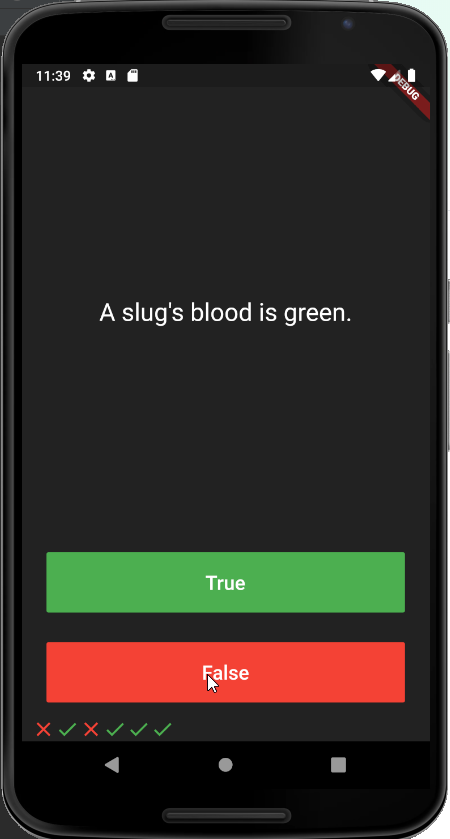

# Simple True or False Quiz App

## What you will create

## What we will be doing:

- Modularising your code into separate classes.
- Dart classes and objects.
- Using class constructors.
- Extracting Widgets to refactor your code.
- private and public modifiers in Dart.
- How to use Dart lists.

## Flutter Packages Used
  - rflutter_alert

